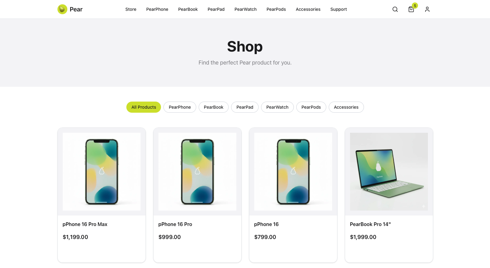
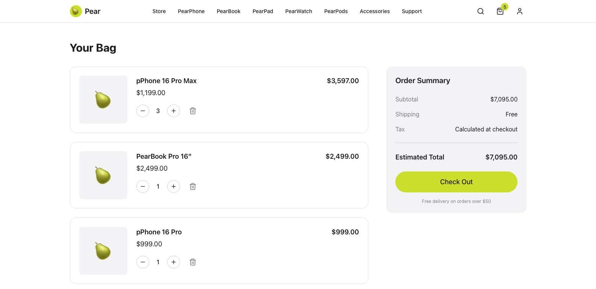
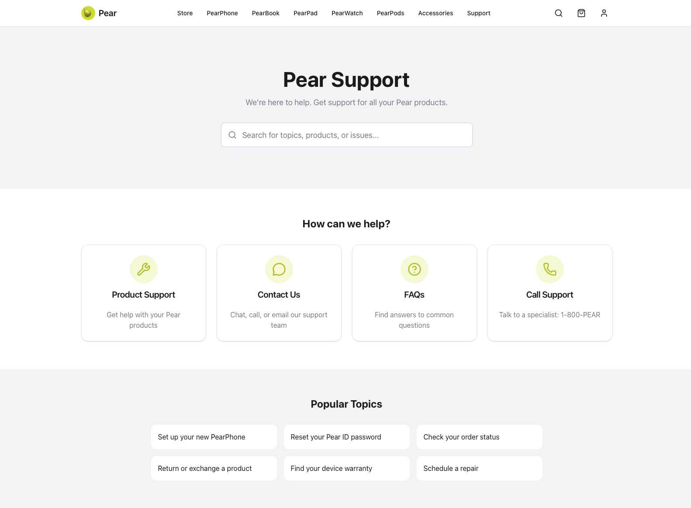

# Enterprise Agentic App with MCP Gateway (*Pear Co*)

## High-Level Overview

The demo is based on *Pear Co*, an Apple-like ficitious company with a product line including laptops and smartphones. *Pear Co* needed to improve their customer support, and decided to implement an agent to provide an improved customer and experience and faster time to resolution.

This demo implements an agentic application within an existing enterprise architecture, and aims to show a realistic solution that focuses on agentic best practices, API-first implementation, RBAC security, and providing significant business value using an agent. 

An additional focus for the demo is to leverage MCP and an agent (API) gateway to provide comprehensive tools derived from existing REST APIs, and control access to those tools using RBAC (based on user roles). For example, a *Pear Co* employee would have access to a different set of MCP tools than a customer would.

The demo is comprised of:

* *Pear Genius*: An agentic application to handle customer support inquiries with personalized support and faster time to resolution. Also, a *Pear Genius* chatbot is integrateed into *Pear Store*

* *Pear Store*: An Apple.com-like website containing an online store and customer support pages

* *Pear Services*: Ten API services supporting *Pear Co*'s enterprise architecture, including backend API support for *Pear Store* and *Pear Genius* (via MCP)

* *Pear Auth*: Authentication and Authorization for *Pear Co.* customers and employees; implemented using [**Keycloak**](https://www.keycloak.org)

* *Pear Gateway*: a dual-purpose API/agent gateway (REST and MCP) that is used by *Pear Store* and *Pear Genius*, and integrates with *Pear Auth*; implemented using [**agentgateway**](https://agentgateway.dev)

## Architecture

```
┌─────────────────────────────────────────────────────────────────────┐
│                         Pear Genius Agent                           │
├─────────────────────────────────────────────────────────────────────┤
│                                                                     │
│  ┌─────────────┐    ┌─────────────────────────────────────────┐     │
│  │   LangGraph │    │           Supervisor Agent              │     │
│  │    Router   │───▶│  (Intent Classification & Orchestration)│     │
│  └─────────────┘    └──────────────┬──────────────────────────┘     │
│                                    │                                │
│         ┌──────────────────────────┼──────────────────────────┐     │
│         ▼                          ▼                          ▼     │
│  ┌─────────────┐          ┌─────────────┐           ┌─────────────┐ │
│  │   Order     │          │  Warranty   │           │Troubleshoot │ │
│  │   Agent     │          │   Agent     │           │   Agent     │ │
│  └──────┬──────┘          └──────┬──────┘           └──-────┬─────┘ │
│         │                        │                          │       │
│         └────────────────────────┼──────────────────────────┘       │
│                                  │                                  │
│                                  ▼                                  │
│                         ┌─────────────────┐                         │
│                         │   MCP Client    │                         │
│                         │  (Tool Calls)   │                         │
│                         └────────┬────────┘                         │
│                                  │                                  │
└──────────────────────────────────┼──────────────────────────────────┘
                                   │ MCP Protocol
                                   │ (SSE/WebSocket)
                                   ▼
┌─────────────────────────────────────────────────────────────────────┐
│                      AgentGateway - MCP Server                      │
│                                                                     │
│  Exposes backend services as MCP Tools:                             │
│  ┌────────────────────────────────────────────────────────────-─┐   │
│  │ • order-management/get_order     • shipping/track_shipment   │   │
│  │ • order-management/list_orders   • shipping/create_label     │   │
│  │ • product-support/check_warranty • payments/process_refund   │   │
│  │ • product-support/get_repairs    • customer-accounts/profile │   │
│  │ • physical-stores/book_appt      • customer-support/tickets  │   │
│  │ • inventory/check_stock          • analytics/get_metrics     │   │
│  └─────────────────────────────────────────────────────────────-┘   │
│                                  │                                  │
└──────────────────────────────────┼──────────────────────────────────┘
                                   │ REST API
                                   ▼
┌─────────────────────────────────────────────────────────────────────┐
│                         Backend Services                            │
├─────────┬─────────┬─────────┬─────────┬─────────┬─────────┬────────-┤
│ order-  │ product │customer │shipping │payments │physical │customer │
│ mgmt    │ support │ accounts│         │         │ stores  │ support │
└─────────┴─────────┴─────────┴─────────┴─────────┴─────────┴───────-─┘
```

## Screenshots and Examples

### Pear Store Screenshots







## Pear Genius Examples

> **Note:** This is an interim version that is CLI-only. A web-based version is coming soon!

```
Starting Pear Genius...
============================================================
  Pear Genius - Customer Support Agent
============================================================

Authenticated as: John Smith (plus member)

Pear Genius: Hello John Smith! I'm Pear Genius, your personal support assistant. I can help you with orders, returns, warranty questions, troubleshooting, and more. How can I assist you today?

You: where is my order?

  Tools used: getOrder

Pear Genius: Here's the status of your recent orders:

## Order #PEAR-2024-123456 (ORD-2024-001) ✅ **DELIVERED**
- **Items**: PearPhone 16 Pro (Space Black, 256GB) + Clear Case
- **Status**: Delivered on January 17th at 2:30 PM
- **Delivery**: Left at front door as requested
- **Tracking**: FedEx #1234567890123456

## Order #PEAR-2024-123458 (ORD-2024-003) 🚚 **IN TRANSIT**
- **Items**: PearPods Pro 2 (White) - Gift order with "Happy Birthday!" message
- **Status**: Currently in transit from Phoenix, AZ
- **Expected Delivery**: January 23rd
- **Tracking**: UPS #1Z999AA10123456784
- **Latest Update**: In transit to destination (Phoenix, AZ - Jan 21, 6:00 PM)

Your PearPhone order has already been delivered, and your PearPods Pro 2 should arrive by January 23rd. You can track the PearPods shipment using the UPS tracking number above.

Is there anything specific about either order you'd like me to help you with?
```

```
You: My PearPhone screen is cracked. Is it covered under warranty?

  Tools used: getOrder, listDevices, getProduct

Pear Genius: Based on your device information, here's what you need to know about warranty coverage for your cracked PearPhone 16 Pro screen:

## **Warranty Coverage for Cracked Screen:**

❌ **Physical damage like cracked screens is NOT covered under Pear's Limited Warranty**

Your PearPhone 16 Pro has:
- **Serial Number**: PEAR-PPH16-2024-001234
- **Warranty Expires**: January 15, 2025 (still under warranty for manufacturing defects)
- **Purchase Date**: January 15, 2024

## **Your Repair Options:**

### **1. Out-of-Warranty Screen Repair**
- **Estimated Cost**: $279-$329 for PearPhone 16 Pro screen replacement
- **Turnaround**: Same day at most Pear Stores
- **Warranty**: 90-day warranty on the repair

### **2. PearCare+ (if you have it)**
If you purchased PearCare+ with your device:
- **Screen repair**: $29 with PearCare+
- **Accidental damage coverage**: Up to 2 incidents per year

### **3. Third-Party Repair**
- Less expensive but may void warranty
- Quality and parts may vary

## **Next Steps:**

1. **Check if you have PearCare+**: I can help verify this
2. **Schedule repair**: Genius Bar appointment or mail-in service
3. **Get quote**: Exact pricing depends on damage extent

**Do you remember purchasing PearCare+ with your PearPhone, or would you like me to help you schedule a repair appointment to get an exact quote?**

The good news is that screen repairs are very common and typically completed quickly!

You: 
```

## Technical Overview

> **Note:** Most of the code for this demo was generated using Claude Code.

### *Pear Genius* Implementation

* Impemented agents are **Supervisor**, **Order**, **Warranty**, and **Troubleshoot** (see Agents.md for more information)
* Agentic features implemented using LangChain and LangGraph
* All LangChain tools are implemented using MCP clients (see *Pear Gateway*'s `agentgateway` and `langchain-mcp-adapters`)
* Implemented in Python with `uv` package management

### *Pear Services* Implementation

* 10 REST API microservice implementations (located under `pear-services`)
* Each service has it's own OpenAPI specification (located at `server/api/openapi.yaml`)
* **OpenAPI Generator** was used to generate Node.js JavaScript Express REST microservice stub code
* **Claude Code** was used to generate the OpenAPI specs, document the OpenAPI specs, finish the implementation of the microservices, and generate sample data

> **Important:** The *Pear Services* OpenAPI specs are completely documented to be understandable by an LLM for the purpose of making tool calls, as the REST APIs are translated into MCP Tools. This is important, as there may be many tools available to the LLM, and proper documentation is important for correct tool usage.

### *Pear Store* Implementation

* A full-featured online store implemented using Next.js and TypeScript
* `@hey-api/openapi-ts` was used to generate REST client implementations from *Pear Services* OpenAPI specifications
* Product and customer support pages
* Integrated chatbot to communicate with *Pear Genius*
* Integrated authentication with *Pear Auth*

### *Pear Auth* Implementation

* Authentication (AuthN) for *Pear Co.* customers and employees
* Authorization (AuthZ) based on user roles to control access to APIs and MCP Tools
* Implemented using [**Keycloak**](https://www.keycloak.org)

### *Pear Gateway* Implementation

* Implemented using [**agentgateway**](https://agentgateway.dev)
* Dual-purpose MCP and REST API gateway that is used by *Pear Store* and *Pear Genius*
* Integrates with *Pear Auth* for AuthZ
* MCP tools are created by **agentgateway** from the *Pear Services* OpenAPI specifications
* *Pear Auth* is used to provide authentication and authorization for MCP Tools and REST APIs

## Running the Demo

This demo can be run locally from the terminal and has been tested on Mac. It requires the presence of `node` and `python3` Tested using `node`. v25.2.0 and `python3` 3.14.2, but it may work with lower versions.

### 1. Run *Pear Auth* (Keycloak)

For running Keycloak, `docker` or `podman` is required.

```shell
docker TODO
```

### 2. Run *Pear Services* (`npm`/Node)

All ten Node services can be built and run concurrently from a top-level `npm` command, rather than having to do it individually. See `pear-services/package.json`. 

```shell
cd pear-services
npm install
npm run start-services
```

The services will now be running on ports 8080 to 8090.

**Control+C** to stop the services from running.

### 3. Run *Pear Gateway* (`agentgateway`)

```shell
curl -sL https://agentgateway.dev/install | bash
agentgateway -f agentgateway.yaml
```

`agentgateway` will now be running on port 3000.

### 4. Run *Pear Store* (`npm`/Next.js)

```shell
cd pear-store
npm install
npm run dev
```

**Control+C** to stop Next.js from running.

### 5. Run *Pear Genius* (Python)

[Install `uv`](https://docs.astral.sh/uv/getting-started/installation/) first, such as running `brew install uv`.

#### Configure `.env`

```shell
cp .env.example .env
```

Edit .env and add your `ANTHROPIC_API_KEY`.

#### Setup Python `venv`

```shell
cd pear-genius
uv venv
uv pip install -e .
```

#### Interactive CLI

```shell
uv run pear-genius
```
